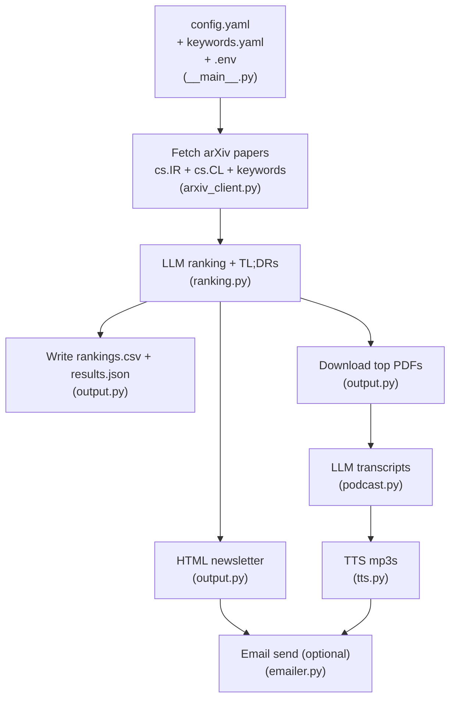

# ArXiv Dialy Newsletter & Podcast

Daily arXiv newsletter and podcast for automatic evaluation research. Fetches recent cs.IR and cs.CL papers plus keyword-matched papers, ranks them with LLM, generates podcast-style audio summaries, and sends email digests.

## Vibe Code Alert

This project was 99% vibe coded as a fun Saturday hack because I wanted to explore the usefulness of receiving an LLM-based, daily podcast-style summary of recent arXiv papers in my field, especially given the tsunami of academic papers being published every day. (Yes, I follow Andrej's [practice](https://github.com/karpathy/llm-council).)

## Quickstart

```bash
# 1. Create environment and install dependencies
uv venv && uv sync

# 2. Configure environment variables
# Create a .env file with OPENAI_API_KEY (plus Gmail creds if email is enabled)

# 3. Customize settings (optional)
# Edit my_config/config.yaml, my_config/keywords.yaml

# 4. Run
uv run -m ir_arxiv_ranker --config my_config/config.yaml
```

## Configuration essentials

Edit `my_config/config.yaml` to control the run:

- `ranking_model`, `podcast_model`: main LLMs for ranking and transcripts.
- `top_n`, `top_n_tts`: how many papers to rank vs. generate audio for.
- `generate_transcript`, `use_tts`: enable/disable transcripts and mp3 audio.
- `email_enabled`: enable/disable Gmail delivery.
- `keywords_path`: keyword list for discovery.

Required `.env` entries when email is enabled:

```bash
OPENAI_API_KEY=...
GMAIL_ADDRESS=...
GMAIL_APP_PASSWORD=...
```

💡 Get a Gmail App Password by enabling 2-Step Verification and generating one in Google Account settings: [Google Account help page](https://support.google.com/accounts/answer/185833)

More details (full config list, pricing, outputs, structure) are in
[`docs/README.md`](docs/README.md).

## Dataflow



Optional steps: transcripts, TTS, and email are controlled by config flags.

## FAQ

**Q. Can I use other LLMs?**
- A. Yes. Swap `ranking_model`, `podcast_model`, and `tts_model` in `my_config/config.yaml` to any supported OpenAI models, and keep `my_config/pricing.json` in sync.


**Q. How much does it cost to run?**
- A. In general, ~$0.50 per run. Details: It depends on the models and how many papers/audio you generate. Costs are tracked during a run and printed at the end; edit `my_config/pricing.json`, `top_n`, `top_n_tts`, and transcript/TTS flags to control spend.


**Q. Can I customize the keywords/retrieval/domain?**
- A. Keywords are fully configurable in `my_config/keywords.yaml`, and limits are in `my_config/config.yaml`.
  - Changing the base arXiv categories (currently `cs.IR` and `cs.CL`) requires a small code tweak in `src/ir_arxiv_ranker/__main__.py` / `src/ir_arxiv_ranker/arxiv_client.py`.
  - Changing retrieval criteria requires edits in the prompt in `prompt/prompt_ranking.j2` (and, for arXiv query filters, `src/ir_arxiv_ranker/arxiv_client.py`).


In either case, the only thing you need to do is open Claude Code/Cursor/Antigravity/Copilot/Cline/etc. and **just vibe code it**. 😎
