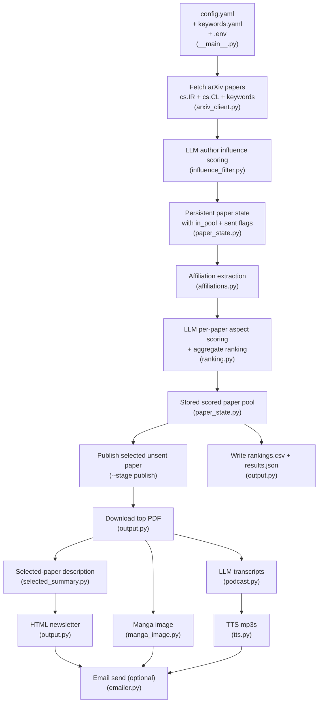

# ArXiv Daily Newsletter & Podcast

Daily arXiv newsletter and podcast for automatic evaluation research. The automation is split into two stages: one action fetches and scores papers into a persistent pool, and a second action reads that stored pool to generate the newsletter, transcript/audio, image, and email.

## Vibe Code Alert

This project was 99% vibe coded as a fun Saturday hack because I wanted to explore the usefulness of receiving an LLM-based, daily podcast-style summary of recent arXiv papers in my field, especially given the tsunami of academic papers being published every day. (Yes, I follow Andrej's [practice](https://github.com/karpathy/llm-council).)

## Quickstart

```bash
# 1. Create environment and install dependencies
uv venv && uv sync

# 2. Configure environment variables
# Create a .env file with OPENAI_API_KEY (plus Gmail creds if email is enabled)

# 3. Customize settings (optional)
# Edit my_config/config.yaml, my_config/keywords.yaml

# 4. Run the full local pipeline
uv run -m ir_arxiv_ranker --config my_config/config.yaml

# Or run the same split used by GitHub Actions
uv run -m ir_arxiv_ranker --config my_config/config.yaml --stage fetch-score
uv run -m ir_arxiv_ranker --config my_config/config.yaml --stage publish

# 5. (Optional) Setup GitHub Actions for automatic daily runs
# See "GitHub Actions schedule" section below
```

## CLI stages

- `--stage fetch-score`: fetches arXiv papers, merges them into `state/discovered_papers.json`, scores author influence, marks only papers with `in_pool: true` for the active author-influence threshold, extracts affiliations for those pool records, scores them, and saves the scored pool.
- `--stage publish`: reads `state/discovered_papers.json`, selects the highest-ranked unsent `in_pool: true` paper, generates the selected-paper description, transcript/audio, manga image, newsletter HTML, sends email if enabled, and marks the selected paper as sent.
- `--stage all`: runs both stages in one process. This is the default for local manual runs.

## Setup Daily Newsletter & Podcast with GitHub Actions

1. Push this repo to GitHub (or fork it).
2. Go to Settings -> Secrets and variables -> Actions, then add the secrets used by your config, including `OPENAI_API_KEY`, `GMAIL_ADDRESS`, and `GMAIL_APP_PASSWORD` when email is enabled.
3. Create or keep the `paper-state` branch. Both workflows read/write `state/discovered_papers.json` from that branch.
4. Edit `.github/workflows/arxiv-fetch-score.yml` if you want to change the paper discovery/scoring interval. It runs hourly on weekdays during the lower-traffic 06:00-16:00 UTC window and stops after one successful scheduled run per cycle.
5. Edit `.github/workflows/arxiv-publish-newsletter.yml` if you want to change the publish time. It runs at 10:00 America/Toronto every day, including weekends and holidays, with no retry dispatcher.
6. Open Actions -> ArXiv Fetch and Score or ArXiv Publish Newsletter -> Run workflow, or wait for the schedules; check logs if a run fails.

## Configuration essentials

Edit `my_config/config.yaml` to control the run:

- `influence_filter`, `influence_score_threshold`: provider/model and minimum score (0-5) for pool inclusion; keep the threshold at `3` to include scores `3`, `4`, and `5`. Papers below the threshold remain in state for deduplication but have `in_pool: false` and are not ranked, published, summarized, converted to audio, or used for images.
- `ranking_aspects_path`, `ranking_max_workers`: separate YAML file for ranking aspect weights and the parallel worker count for per-paper ranking scores.
- `ranking`, `podcast`, `manga_planner`, `affiliation`: provider/model pairs for each LLM call family.
- `manga_image`: OpenAI image generation settings for the selected-paper image attachment.
- `top_n`, `top_n_tts`: how many pooled papers to include in ranking outputs and whether to generate audio for the selected paper.
- `generate_transcript`, `use_tts`: enable/disable transcripts and mp3 audio.
- `generate_manga_image`: enable/disable selected-paper image generation.
- `include_keyword_papers`: set to `false` for IR/CL only mode (excludes keyword-matched papers).
- `email_enabled`: enable/disable Gmail delivery.
- `keywords_path`: keyword list for discovery.

Environment variables depend on the enabled providers:

```bash
OPENAI_API_KEY=...
GMAIL_ADDRESS=...
GMAIL_APP_PASSWORD=...
OPENROUTER_API_KEY=...  # only when using OpenRouter
GEMINI_API_KEY=...      # only when using Gemini
PRIORITY_AUTHORS=...    # optional; semicolon-delimited
MANGA_STYLE_PROMPT=...   # optional; private image style hint
```

💡 Get a Gmail App Password by enabling 2-Step Verification and generating one in Google Account settings: [Google Account help page](https://support.google.com/accounts/answer/185833)

More details (full config list, pricing, outputs, structure) are in
[`docs/README.md`](docs/README.md).

## Dataflow


```mermaid
flowchart TD
  A["config.yaml<br>+ keywords.yaml<br>+ .env<br/>(__main__.py)"] --> B["Fetch arXiv papers<br/>cs.IR + cs.CL + keywords<br/>(arxiv_client.py)"]
  B --> C["LLM author influence scoring<br/>(influence_filter.py)"]
  C --> D["Persistent paper state<br/>with in_pool + sent flags<br/>(paper_state.py)"]
  D --> A1["Affiliation extraction<br/>(affiliations.py)"]
  A1 --> E["LLM per-paper aspect scoring<br/>+ aggregate ranking<br/>(ranking.py)"]
  E --> S1["Stored scored paper pool<br/>(paper_state.py)"]
  S1 --> P["Publish selected unsent paper<br/>(--stage publish)"]
  S1 --> F["Write rankings.csv + results.json<br/>(output.py)"]
  P --> G["Download top PDF<br/>(output.py)"]
  G --> L["Selected-paper description<br/>(selected_summary.py)"]
  G --> M["Manga image<br/>(manga_image.py)"]
  G --> H["LLM transcripts<br/>(podcast.py)"]
  H --> I["TTS mp3s<br/>(tts.py)"]
  L --> J["HTML newsletter<br/>(output.py)"]
  J --> K["Email send (optional)<br/>(emailer.py)"]
  M --> K
  I --> K
```

Optional steps: transcripts, TTS, image generation, and email are controlled by config flags.

## Email statistics

The publish email shows four stored-pool statistics. These are computed only from unsent records with `in_pool: true`:

- `Unsent pool`: total unsent papers currently in `state/discovered_papers.json`.
- `Fetched 24h`: unsent papers seen by a fetch-score run in the last 24 hours.
- `Unique 24h`: papers from those last-24-hour fetches that were new unique additions to the pool.
- `Added 7d`: unsent papers first added to the pool in the last 7 days.

## FAQ

**Q. Can I use other LLMs?**
- A. Yes. Swap the nested provider/model pairs such as `ranking.model`, `podcast.model`, `tts.model`, `manga_planner.model`, and `affiliation.model` in `my_config/config.yaml`, then keep `my_config/pricing.json` in sync. Set a provider to `openrouter` only when the relevant code path supports OpenRouter and `OPENROUTER_API_KEY` is configured.


**Q. How much does it cost to run?**
- A. In general, ~$0.50 per run. Details: It depends on the models and how many papers/audio you generate (author-influence scoring adds an extra LLM pass). Costs are tracked during a run and printed at the end; edit `my_config/pricing.json`, `top_n`, `top_n_tts`, and transcript/TTS flags to control spend.


**Q. Can I customize the keywords/retrieval/domain?**
- A. Keywords are fully configurable in `my_config/keywords.yaml`, and limits are in `my_config/config.yaml`.
  - Changing the base arXiv categories (currently `cs.IR` and `cs.CL`) requires a small code tweak in `src/ir_arxiv_ranker/__main__.py` / `src/ir_arxiv_ranker/arxiv_client.py`.
  - Changing scoring criteria requires edits in `prompt/prompt_scoring.j2` and `my_config/ranking_aspects.yaml` (and, for arXiv query filters, `src/ir_arxiv_ranker/arxiv_client.py`).


In either case, the only thing you need to do is open Claude Code/Cursor/Antigravity/Copilot/Cline/etc. and **just vibe code it**. 😎
